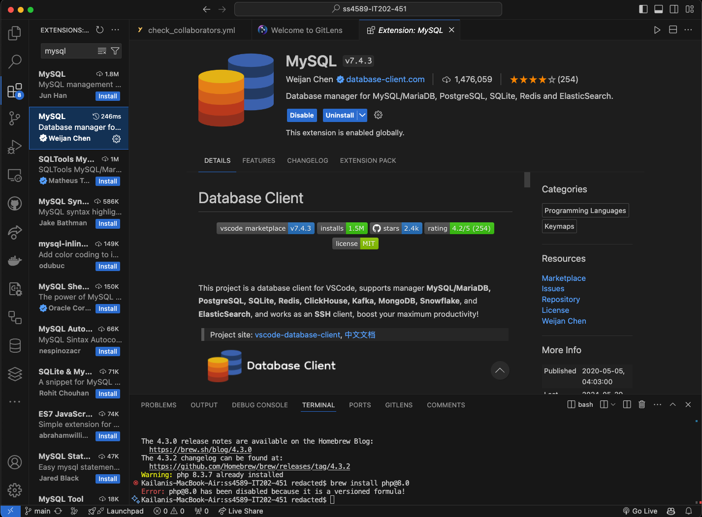

<table><tr><td> <em>Assignment: </em> IT202-M1-GettingStarted</td></tr>
<tr><td> <em>Student: </em> Shahbaj Singh (ss4589)</td></tr>
<tr><td> <em>Generated: </em> 6/2/2024 10:42:30 PM</td></tr>
<tr><td> <em>Grading Link: </em> <a rel="noreferrer noopener" href="https://learn.ethereallab.app/homework/IT202-AR451-M2024/it202-m1-gettingstarted/grade/ss4589" target="_blank">Grading</a></td></tr></table>
<table><tr><td> <em>Instructions: </em> <ol><li>Create a repository on github, use the format [ucid]-[course]-[section] as the repository name.</li><li>Make sure it's set to private</li><li>Go to Settings -&gt; Collaborators -&gt; Invite Collaborator -&gt; Search for my ID&nbsp;<strong>MattToegel</strong>&nbsp;and send an invite; if your section has a grader do the same for their github id<ol><li>Note: Once in a while the invite doesn't get created correctly and you'll need to resend it, keep an eye on the acceptance of the invite since this is required for further HW validations. A comment will be left on Canvas for the submission if the invite is missing at the time of grading).</li></ol></li><li>From the terminal / command line create a new branch called M1-GettingStarted</li><li>Create a README.md file and add it to the branch</li><li>Fill in some basic details:<ol><li>Course/Section</li><li>Your name (first is fine)</li><li>Brief info about yourself you'd like to share</li></ol></li><li>Hint after creating the file<ol><li><code>git add README.md</code></li><li><code>git commit -m "my readme file"</code></li><li><code>git push origin M1-GettingStarted</code></li><li>Create a pull request from this branch (via github.com)</li><li>Don't merge/close the pull request yet</li></ol></li><li>create a new file called M1_Submission.md (the content of this output will be inserted there)<ol><li>Once done, add, commit, push the submission md file, then you may merge the Pull Request</li></ol></li><li>Submit the direct link to this file from the master/main branch</li></ol></td></tr></table>
<table><tr><td> <em>Deliverable 1: </em> IDE Setup Evidence </td></tr><tr><td><em>Status: </em> </td></tr>
<tr><td><table><tr><td> <em>Sub-Task 1: </em> Screenshot showing requested extensions installed</td></tr>
<tr><td><table><tr><td></td></tr>
<tr><td> <em>Caption:</em> 
WakaTime installed and configured proof (dashboard access requires API key)  

</td></tr>
<tr><td></td></tr>
<tr><td> <em>Caption:</em> 
MySQL installed proof 

</td></tr>
<tr><td></td></tr>
<tr><td> <em>Caption:</em> 
Intelephense installed proof 

</td></tr>
</table></td></tr>
</table></td></tr>
<table><tr><td> <em>Deliverable 2: </em> Verify Database Creation/Connectivity </td></tr><tr><td><em>Status: </em> </td></tr>
<tr><td><table><tr><td> <em>Sub-Task 1: </em>  Screenshot showing your database from your IDE MySQL extension</td></tr>
<tr><td><table><tr><td></td></tr>
<tr><td> <em>Caption:</em> 
Shown VS Code left panel 

</td></tr>
<tr><td></td></tr>
<tr><td> <em>Caption:</em> 
Shows database name with UCID 

</td></tr>
</table></td></tr>
</table></td></tr>
<table><tr><td> <em>Deliverable 3: </em> Discussion </td></tr><tr><td><em>Status: </em> </td></tr>
<tr><td><table><tr><td> <em>Sub-Task 1: </em> Talk about what you learned during this module, anything interesting, new, etc.</td></tr>
<tr><td> <em>Response:</em> 
Despite being in my senior year, I learned quite a few things from this assignment. I have created and merged one pull request before in CS490; creating one in this assignment allowed me to gain more experience working between branches. One new practice I learned was how to connect a MySQL remote database to my IDE through VS Code itself, as I&#39;m used to simply using one locally with MySQL Workbench.  
 </td></tr>
</table></td></tr>
<table><tr><td> <em>Deliverable 4: </em> Issues </td></tr><tr><td><em>Status: </em> </td></tr>
<tr><td><table><tr><td> <em>Sub-Task 1: </em> Did you have any issues? If so, how did you resolve them? If no issues, just type "no issues".</td></tr>
<tr><td> <em>Response:</em> 
I am unable to upload images on this learn platform by either drag and dropping or pasting (tried using Firefox and Safari) so I have uploaded proof screenshots directly to my class GitHub repository so that grader may view them (I have invited them as collaborator as per instructions). Other than that, no issues. Please let me know if there are any issues with this. I can switch to using a public image hosting platform if need be.

 

Also, as I revisit this submission, it has come to my attention that the dropdown for which checklist item is associated with the picture is not saving, so I have added it as part of the caption. 
  </td></tr>
</table></td></tr>
<table><tr><td> <em>Deliverable 5: </em> Pull Request Link </td></tr><tr><td><em>Status: </em> </td></tr>
<tr><td><table><tr><td> <em>Sub-Task 1: </em> Add the pull request link here (it should end in /pull/#)</td></tr>
<tr><td> <a rel="noreferrer noopener" target="_blank" href="https://github.com/shahbajsingh/ss4589-IT202-451/pull/1">https://github.com/shahbajsingh/ss4589-IT202-451/pull/1</a> </td></tr>
</table></td></tr>
<table><tr><td><em>Grading Link: </em><a rel="noreferrer noopener" href="https://learn.ethereallab.app/homework/IT202-AR451-M2024/it202-m1-gettingstarted/grade/ss4589" target="_blank">Grading</a></td></tr></table>

